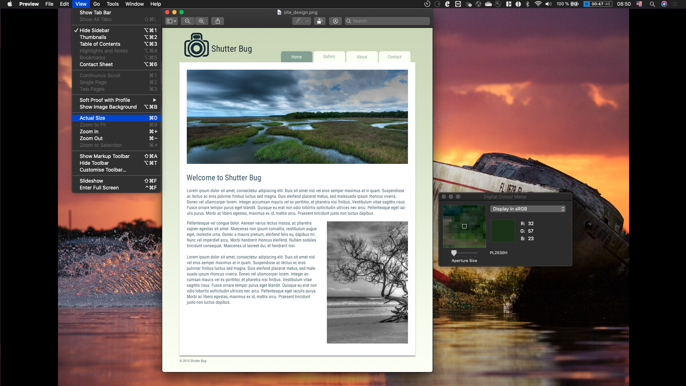

# LS 202 - HTML & CSS course

This is the repository the Launch School's LS202 course project: *On Your Own: Using a PNG Design File*.

The idea of this project is to replicate the [web-page design](./assets/images/site_design.png) provided in `.png` format using HTML and CSS client code with the pre-installed MAC applications:
- [Preview](https://support.apple.com/en-gb/guide/preview/welcome/mac)
- [Digital Colour Meter](https://support.apple.com/en-gb/guide/digital-color-meter/welcome/mac)

The Preview program is used to get the approximations of heigth or width of a given element, padding, margin, etc. 

Useful keyboard shortcut for the Preview is: 
- `CMD + O` View in Actual size, which can also be found in: **Preview -> View -> Actual Size**

Useful keyboard shortcut for the Digital Colour Meter is: 
- `CMD + Schift + C` Copy current pixel color code in RGB. Make sure to choose `Display in sRGB` in the menu dropdown.
